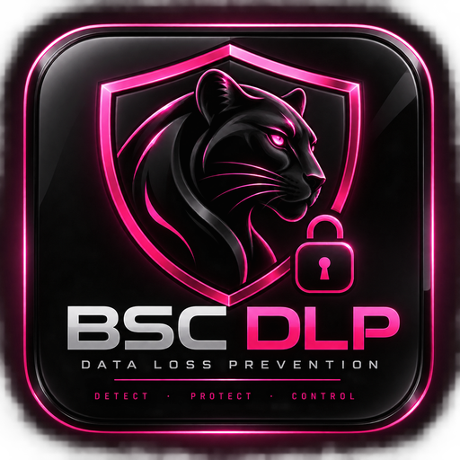
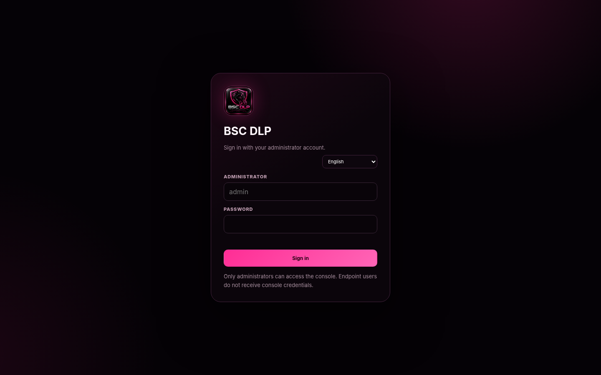
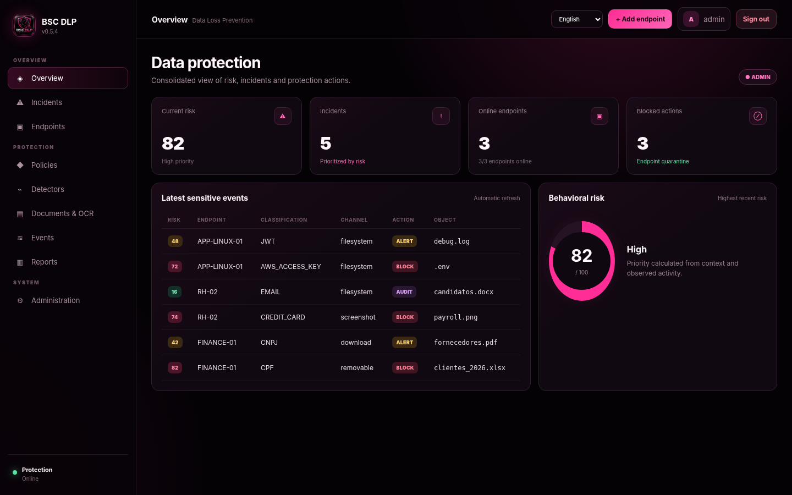
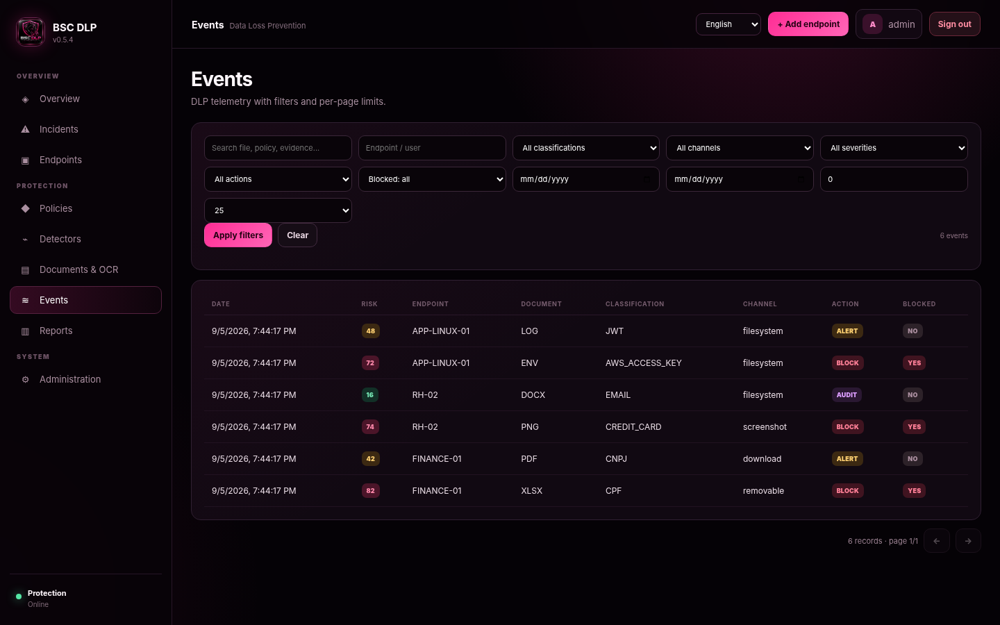
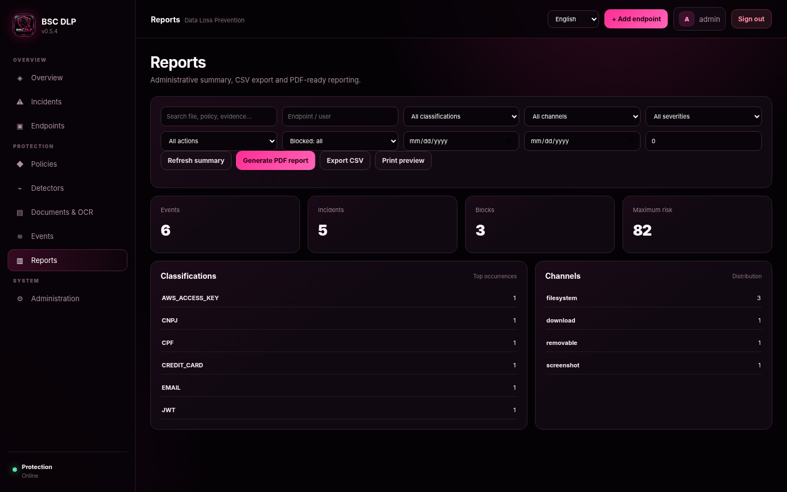
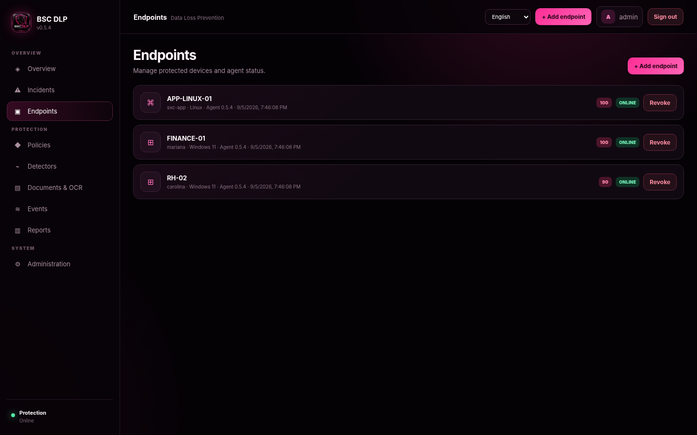
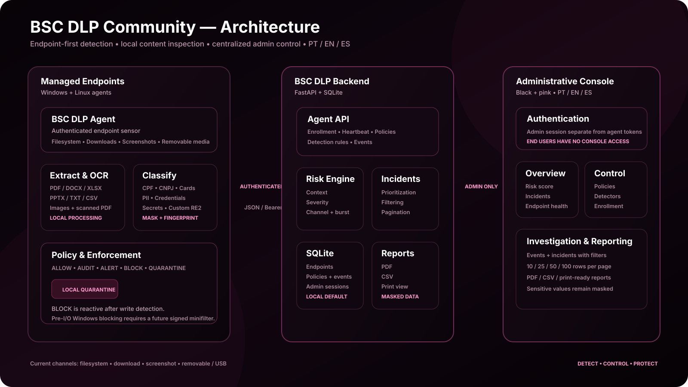

<div align="center">
  

  # BSC DLP Community

  **Open-source Data Loss Prevention for Windows & Linux endpoints**  
  **Detect • Classify • Control • Protect**

  <sub>Console administrativa em Português, English e Español · Endpoint-first · Community driven</sub>

  <br><br>

  [](https://github.com/marianabsctba/BSC_DLP_Community/actions/workflows/ci.yml)
  
  
  
  
  
  
</div>

---

## What is BSC DLP?

**BSC DLP Community** is an open-source Data Loss Prevention project focused on **endpoint visibility, sensitive-data classification, policy enforcement, behavioral risk and investigation**.

The endpoint agent inspects content **locally**, applies classifiers and policies, and sends the console only the telemetry required for investigation — such as classification, masked value, fingerprint, object hash, channel, risk and enforcement result.

The project is designed around a simple principle:

> **Do not only ask _what sensitive data exists_. Ask _what is being done with it_.**

### 🇧🇷 Resumo

DLP open source com agente Windows/Linux, inspeção local de documentos, OCR, políticas, bloqueio/quarentena, incidentes, filtros, paginação e relatórios administrativos.

### 🇪🇸 Resumen

DLP open source con agente Windows/Linux, inspección local de documentos, OCR, políticas, bloqueo/cuarentena, incidentes, filtros, paginación e informes administrativos.

---

## Screenshots

> Screenshots below use **synthetic demo data**. No real personal or production data is included.

### Admin login

<div align="center">
  
</div>

### Risk & protection overview

<div align="center">
  
</div>

### Events, filters and pagination

<div align="center">
  
</div>

<table>
<tr>
<td width="50%" valign="top">
<strong>Reports</strong><br><br>

</td>
<td width="50%" valign="top">
<strong>Managed endpoints</strong><br><br>

</td>
</tr>
</table>

---

## Architecture

<div align="center">
  
</div>

### Data flow

```text
Endpoint activity
      ↓
BSC DLP Agent
      ↓
Local extraction / OCR
      ↓
Native + custom classifiers
      ↓
Policy resolution
      ↓
ALLOW / AUDIT / ALERT / BLOCK / QUARANTINE
      ↓
Masked event telemetry
      ↓
FastAPI + SQLite
      ↓
Risk / incidents / reports
      ↓
Admin-only console
```

---

## Current capabilities

### Endpoint channels

| Channel | Status | What it covers |
|---|:---:|---|
| Filesystem | ✅ | Sensitive files observed in monitored folders |
| Downloads | ✅ | Browser/download folders, including settle/rename handling |
| Screenshots | ✅ | Image inspection with OCR |
| Removable / USB | ✅ | Sensitive objects written to removable media |

### Documents & OCR

Extraction happens **on the endpoint**. Raw documents are not uploaded to the administrative console.

| Format | Inspection |
|---|---|
| PDF | Text extraction + best-effort parser + OCR fallback for scanned PDFs |
| DOCX | OpenXML text extraction |
| XLSX | Worksheets/shared strings extraction |
| PPTX | Slides/notes extraction |
| TXT / CSV / JSON / XML / LOG / MD | Native text inspection |
| PNG / JPG / JPEG / TIFF / BMP / WEBP | Tesseract OCR |

For scanned PDFs, OCR is available when **Tesseract + `pdftoppm`** are available on the endpoint.

### Native classifiers

- **CPF** — checksum validation
- **CNPJ** — checksum validation
- **Credit card** — Luhn validation
- **E-mail address**
- **Brazilian RG** — contextual detection
- **CEP** — contextual detection
- **Brazilian phone number**
- **PIX key**
- **Bank account**
- **Passport**
- **Credentials**
- **Secrets** — including common cloud/API/token patterns

The admin can also create **custom RE2-compatible regex detectors** without recompiling the agent.

Example:

```text
Pattern:        CONTRATO-[0-9]{8}
Classification: CONTRACT_ID
```

Custom detection rules are distributed to authenticated agents automatically.

---

## Policy engine

Policies are resolved by **classification + channel + priority**.

Supported actions:

| Action | Behavior |
|---|---|
| `ALLOW` | Explicitly allow |
| `AUDIT` | Record activity |
| `ALERT` | Record and raise visibility/risk |
| `BLOCK` | Enforce endpoint quarantine when possible |
| `QUARANTINE` | Move the detected object into local quarantine |

Default protection includes, among others, **CPF screenshot blocking**, **CPF/CNPJ/card data on removable media**, and protections for credentials/secrets.

### Enforcement honesty

Current filesystem enforcement is **reactive after the write is observed**. When a `BLOCK` or `QUARANTINE` policy succeeds, the object is copied into local endpoint quarantine and removed from the source path; the event records `blocked=true` only after successful enforcement.

BSC DLP **does not claim pre-I/O kernel blocking yet**.

True Windows pre-write prevention requires a **signed minifilter driver**, which remains a planned enforcement module.

---

## Behavioral risk & incidents

BSC DLP calculates risk using context such as:

- classification and severity;
- channel (`download`, `screenshot`, `removable`, etc.);
- policy action;
- successful blocking;
- recent event bursts from the same endpoint.

High-risk activity is surfaced as prioritized incidents, for example:

```text
Possible removable-media exfiltration
Endpoint: FINANCE-01
Classification: CPF
Channel: removable
Action: BLOCK
Risk: 82/100
```

The objective is to correlate **data + context + action**, instead of producing a flat list of regex matches.

---

## Admin-only console

Endpoint users **do not receive console credentials**.

Administrative and agent authentication are separate:

- first access creates the administrator;
- passwords are derived using `scrypt` + salt;
- admin sessions use HttpOnly / SameSite cookies;
- endpoints use individual Bearer credentials;
- enrollment codes are temporary and use-limited;
- endpoint credentials can be revoked from the console.

The console includes:

- overview and behavioral risk;
- incidents;
- managed endpoints;
- policies;
- native and custom detectors;
- document/OCR capabilities;
- events;
- reports;
- administrative settings.

---

## Filters, pagination & reporting

Events and incidents can be filtered by criteria such as:

- date/time range;
- endpoint or user;
- classification;
- channel;
- severity;
- action;
- blocked state;
- minimum risk;
- search text.

Pagination supports **10 / 25 / 50 / 100** rows per page.

Reports support:

- **real PDF generation**;
- CSV export;
- print view;
- executive metrics;
- classification/channel/action distribution;
- filtered event detail;
- masked values rather than raw sensitive content.

CSV export includes mitigation for spreadsheet formula injection.

---

## PT / EN / ES

The administrative interface supports:

- 🇧🇷 **Português**
- 🇺🇸 **English**
- 🇪🇸 **Español**

The selected language is remembered by the browser and is also used by **PDF, CSV and print reports**.

Technical constants such as `BLOCK`, `AUDIT`, classification names and channel identifiers remain stable to simplify investigation and integrations.

---

## Quick start — Windows source mode

### Requirements

For development/source mode:

- Windows 10/11
- **Python 3.10+**
- **Go 1.22+**

The prebuilt Community release can package the backend and agent so end users do not need Python or Go installed.

### Clone

```powershell
git clone https://github.com/marianabsctba/BSC_DLP_Community.git
cd BSC_DLP_Community
```

### Start

```powershell
.\START-BSC-DLP.cmd
```

The launcher prepares the local runtime, starts the backend and endpoint agent, and opens the console.

On first access, create the administrator account.

### Stop

```powershell
.\STOP-BSC-DLP.cmd
```

### Reset local lab data

```powershell
.\RESET-BSC-DLP.cmd
```

This removes local Community runtime data such as the lab database and local credentials. Use it intentionally.

---

## Central console for LAN endpoints

For a trusted lab/LAN environment:

```powershell
.\START-BSC-DLP-LAN.cmd
```

Then, from the admin console:

1. Open **Endpoints**.
2. Click **Add endpoint**.
3. Generate a temporary enrollment code.
4. Run the generated installer command on the target endpoint.

Example:

```powershell
.\INSTALL-ENDPOINT.cmd "http://SERVER:8000" "TEMPORARY-ENROLLMENT-CODE"
```

> For production or untrusted networks, publish the central console behind **TLS / a properly configured reverse proxy**. Do not expose a plain HTTP management service to the Internet.

---

## Local runtime

Windows Community console runtime:

```text
%LOCALAPPDATA%\BSC-DLP-Community
```

Installed endpoint runtime:

```text
%LOCALAPPDATA%\BSC-DLP-Endpoint
```

Quarantine lives in the runtime area — not inside the repository checkout.

The repository `.gitignore` is intended to keep databases, credentials, logs, virtual environments and local runtime artifacts out of Git.

---

## Security model

BSC DLP Community is designed to minimize unnecessary sensitive-data movement:

- document extraction occurs locally on the endpoint;
- the console receives masked values and fingerprints rather than raw matched values;
- object SHA-256 hashes support evidence correlation;
- admin and agent authentication are separated;
- endpoint credentials are individually revocable;
- reports avoid exposing raw detected secrets/PII;
- the project does not claim kernel enforcement capabilities that are not implemented.

Please read [`SECURITY.md`](SECURITY.md) before exposing a central console beyond a local lab environment.

---

## Project structure

```text
BSC_DLP_Community/
├── agent/                  # Go endpoint agent
│   ├── detectors.go
│   ├── extractors.go
│   ├── enforcement.go
│   ├── platform_windows.go
│   └── platform_linux.go
├── api/                    # FastAPI backend
├── classifiers/            # classifier helpers/patterns
├── dashboard/              # black + pink admin console
│   └── assets/             # official BSC DLP brand
├── docs/
│   ├── architecture.svg
│   └── screenshots/
├── scripts/windows/        # start, build, install, reset, uninstall
├── tests/                  # backend/API regression tests
├── .github/workflows/      # CI and Windows release workflow
├── START-BSC-DLP.cmd
├── INSTALL-ENDPOINT.cmd
└── README.md
```

---

## Tests

### Backend / API

```powershell
python -m pip install -r requirements-dev.txt
pytest -q
```

### Agent

```powershell
cd agent
go test ./...
```

### OCR smoke test

```powershell
.\TEST-OCR-DOWNLOAD.cmd
```

The OCR smoke test creates synthetic test content in Downloads so you can verify the image → OCR → classification → policy → event pipeline.

---

## Build a Community Windows release

```powershell
powershell.exe -NoProfile -ExecutionPolicy Bypass `
  -File .\scripts\windows\Build-Community-Release.ps1 `
  -Version 0.5.4
```

GitHub workflows include:

- `ci.yml` — regression/tests on push and pull request;
- `windows-release.yml` — Windows Community release build.

---

## Roadmap

- [ ] Signed Windows minifilter for true pre-write enforcement
- [ ] Advanced Device Control: VID/PID/serial, allowlist and read-only policies
- [ ] Email DLP
- [ ] AI DLP / AI Gateway for prompts and uploads
- [ ] Clipboard and additional controlled channels
- [ ] Additional classifier packs and policy templates
- [ ] Multi-admin RBAC for larger environments
- [ ] Hardened production deployment guidance

---

## What BSC DLP does **not** claim today

To keep the project technically honest:

- it is **not** an EDR/XDR replacement;
- it does not yet provide Windows kernel pre-write blocking;
- Email DLP and AI DLP are roadmap modules, not current production capabilities;
- the local SQLite deployment is a Community/default architecture, not a claim of hyperscale storage;
- public/Internet deployment requires additional production hardening and TLS architecture.

---

## Contributing

Community contributions are welcome. Please read [`CONTRIBUTING.md`](CONTRIBUTING.md) and [`SECURITY.md`](SECURITY.md).

Useful contribution areas include:

- classifier quality and false-positive reduction;
- Windows/Linux endpoint telemetry;
- document parsers;
- OCR handling;
- policy/risk logic;
- tests;
- internationalization;
- documentation.

---

## License

BSC DLP Community is distributed under the **GNU Affero General Public License v3.0 (AGPL-3.0)**.

See [`LICENSE`](LICENSE) for the complete license text.

---

<div align="center">
  
  <br><br>
  <strong>BSC DLP Community</strong><br>
  <sub>Detect • Classify • Control • Protect</sub>
  <br><br>
  🩷 Open source. Community driven. Built for practical data protection.
</div>
