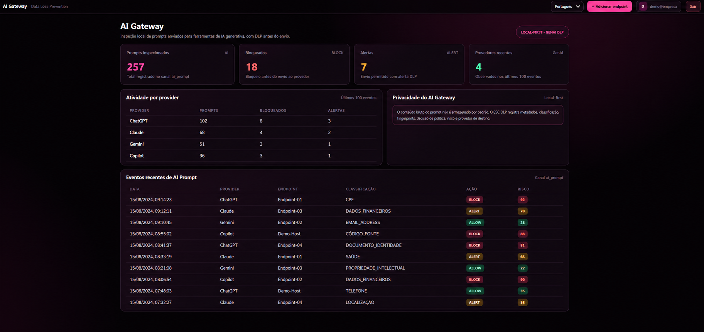

<div align="center">
  

  # BSC DLP Community

  **Open-source Data Loss Prevention for Windows & Linux endpoints**  
  **Detect • Classify • Correlate • Control • Protect**

  <sub>Console administrativa em Português, English e Español · Endpoint-first · Local-first · Browser Guard · Community driven</sub>

  <br><br>

  [](https://github.com/marianabsctba/BSC_DLP_Community/actions/workflows/ci.yml)
  
  
  
  
  
  
  
</div>

---

## What is BSC DLP?

**BSC DLP Community** is an open-source Data Loss Prevention project focused on **endpoint visibility, sensitive-data classification, policy enforcement, behavioral/contextual risk and investigation**.

The endpoint agent inspects content **locally**, applies classifiers and policies, and sends the console only the telemetry required for investigation — such as classification, masked value, fingerprint, object hash, channel, destination, risk, context and enforcement result.

The project is designed around a simple principle:

> **Do not only ask _what sensitive data exists_. Ask _what is being done with it, where it is going and how risky that context is_.**

### 🇧🇷 Resumo

DLP open source com agente Windows/Linux, inspeção local de documentos, OCR, políticas, bloqueio/quarentena, screenshots, clipboard, WhatsApp Web, uploads no navegador, risco contextual, incidentes, filtros, paginação e relatórios administrativos.

### 🇪🇸 Resumen

DLP open source con agente Windows/Linux, inspección local de documentos, OCR, políticas, bloqueo/cuarentena, capturas de pantalla, portapapeles, WhatsApp Web, cargas en navegador, riesgo contextual, incidentes, filtros, paginación e informes administrativos.

---

## Screenshots

> Screenshots below use **synthetic demo data**. No real personal or production data is included.

### Admin login

<div align="center">
  
</div>

### Risk & protection overview

<div align="center">
  
</div>

### AI Gateway — Generative AI DLP

<div align="center">
  
</div>

### Events, filters and pagination

<div align="center">
  
</div>

<table>
<tr>
<td width="50%" valign="top">
<strong>Reports</strong><br><br>

</td>
<td width="50%" valign="top">
<strong>Managed endpoints</strong><br><br>

</td>
</tr>
</table>

> 💡 New v0.6.x screenshots for **WhatsApp Web**, **Browser Upload DLP**, **clipboard screenshot OCR** and **context-aware incidents** can be added under `docs/screenshots/` without changing the product architecture or documentation structure.

---

## Architecture

<div align="center">
  
</div>

### Data flow

```text
Endpoint / browser activity
      ↓
BSC DLP Agent / Browser Guard
      ↓
Local extraction / OCR / normalization
      ↓
Native + custom classifiers
      ↓
Context + correlation
      ↓
Risk scoring
      ↓
Policy resolution
      ↓
ALLOW / AUDIT / ALERT / BLOCK / QUARANTINE
      ↓
Masked event telemetry
      ↓
FastAPI + SQLite
      ↓
Risk / incidents / reports
      ↓
Admin-only console
```

### Browser Guard local flow

```text
Chromium Browser
      ↓
BSC DLP Browser Guard
      ↓
127.0.0.1:8765
      ↓
Go endpoint agent
      ↓
Same detector + policy engine
```

The Browser Guard bridge is local to the endpoint and is **not intended as a public network service**.

---

## Current capabilities

### Endpoint & browser channels

| Channel | Status | What it covers |
|---|:---:|---|
| Filesystem | ✅ | Sensitive files observed in monitored folders |
| Downloads | ✅ | Browser/download folders, including settle/rename handling |
| Screenshots — saved files | ✅ | Image inspection with OCR |
| Screenshots — clipboard | ✅ Windows | Snipping Tool / Win+Shift+S clipboard image OCR |
| Removable / USB | ✅ | Sensitive objects written to removable media |
| Desktop messaging clipboard | ✅ Windows | Clipboard inspection while supported messaging apps are foreground |
| WhatsApp Web text | ✅ Chromium Browser Guard | Paste/send inspection before outgoing action |
| Generic browser upload | ✅ Chromium Browser Guard | File picker / upload interception with local inspection |
| AI Gateway prompt DLP | ✅ Chromium Browser Guard | Pre-send inspection for ChatGPT, Claude, Gemini and Copilot |

### 🤖 AI Gateway

BSC DLP can inspect prompts before they are submitted to supported generative AI web applications.

Current supported destinations include:

- ChatGPT;
- Claude;
- Gemini;
- Microsoft Copilot.

The AI Gateway reuses the local BSC DLP detection and policy pipeline and supports:

- local prompt inspection before send;
- native and custom sensitive-data classifiers;
- `ALLOW`, `ALERT` and `BLOCK` decisions;
- provider-aware destination telemetry;
- contextual risk scoring;
- dedicated `ai_prompt` events;
- AI Gateway dashboard metrics and recent activity;
- masked sensitive values and fingerprints instead of raw matched values.

By default, the raw prompt is not intentionally persisted by BSC DLP. Event telemetry records the information required for investigation, such as classification, policy decision, risk, provider, fingerprints and masked detections.

> AI Gateway enforcement is currently Browser Guard / DOM-level integration. Provider web interfaces can change and may require adapter updates. When the local bridge is unavailable, the current Community behavior is fail-open with a visible warning.
### 💬 WhatsApp Web Browser Guard

BSC DLP can inspect outgoing text in **WhatsApp Web** before paste/send actions.

Current behavior includes:

- outgoing composer text inspection;
- paste interception;
- Enter/send interception;
- send-button interception;
- reuse of the same native/custom classifiers and policy engine;
- `ALLOW`, `ALERT` or `BLOCK` decisions before send when interception succeeds.

The Browser Guard:

- does **not** read chat history;
- does **not** decrypt or bypass end-to-end encryption;
- does **not** scrape messages from conversations;
- only analyzes the content involved in the outgoing user action.

### 🌐 Generic Browser Upload DLP

BSC DLP can inspect files selected for upload on regular HTTP/HTTPS pages.

Supported browser interaction paths include:

- `<input type="file">`;
- file picker selection;
- drag & drop;
- paste events containing files/images.

Upload inspection uses the local bridge and the existing extractor/OCR pipeline:

```text
Web page
   ↓
Browser Guard
   ↓
Chunked local transfer
   ↓
Temporary endpoint copy
   ↓
Extractor / OCR
   ↓
Sensitive-data classification
   ↓
Policy
   ↓
ALLOW / ALERT / BLOCK
```

Important properties:

- original file bytes remain on the endpoint;
- the temporary inspection copy is deleted after processing;
- the backend receives masked event telemetry, not the raw file;
- destination hostname is added to event context;
- `browser_upload` is treated as an external destination;
- when interception succeeds, `BLOCK` can stop the file **before the page receives the upload action**.

> Browser Upload DLP is **DOM-level, best-effort enforcement**. It is not a network proxy, kernel control or browser-vendor security engine. Complex web applications may require specific handling.

### 🖥️ Desktop messaging clipboard sensor

On Windows, BSC DLP can inspect clipboard text while selected desktop messaging applications are in the foreground.

Current targets include:

- WhatsApp Desktop;
- Microsoft Teams;
- Slack;
- Telegram;
- Discord.

The sensor:

- does not read chats;
- does not scrape history;
- does not decrypt messaging traffic;
- inspects clipboard content locally;
- can clear the clipboard when a `BLOCK` policy applies.

### 📸 Clipboard Screenshot OCR

BSC DLP monitors screenshot images placed directly into the Windows clipboard, including common **Snipping Tool / Win+Shift+S** workflows.

```text
Windows clipboard image
      ↓
CF_BITMAP
      ↓
24-bit BI_RGB normalization
      ↓
Tesseract OCR
      ↓
Shared detector / policy engine
      ↓
AUDIT / ALERT / BLOCK
```

The raw clipboard image is not intentionally sent to the backend.

When a blocking policy applies, BSC DLP can clear the clipboard **after OCR and detection**.

> This is reactive after capture/OCR. It is not pre-capture blocking.

---

## Documents & OCR

Extraction happens **on the endpoint**. Raw documents are not uploaded to the administrative console.

| Format | Inspection |
|---|---|
| PDF | Text extraction + best-effort parser + OCR fallback for scanned PDFs |
| DOCX | OpenXML text extraction |
| XLSX | Worksheets/shared strings extraction |
| PPTX | Slides/notes extraction |
| TXT / CSV / JSON / XML / LOG / MD | Native text inspection |
| `.env` / `.pem` / `.key` / `.sql` | Text inspection / high-value context |
| PNG / JPG / JPEG / TIFF / BMP / WEBP | Tesseract OCR |

For scanned PDFs, OCR is available when the endpoint OCR toolchain is available.

---

## Sensitive Data Catalog & Confidence Engine

BSC DLP separates **what a sensitive-data class means** from **how it was detected**.

The current catalog is designed around principles from:

- LGPD / ANPD;
- NIST PII / linked and linkable information concepts;
- GDPR special categories and online identifiers;
- PCI DSS cardholder and sensitive authentication data;
- practical DLP confidence models using pattern + evidence + context.

### Data families

| Family | Examples | Treatment |
|---|---|---|
| `pii` | CPF, RG, CNH, passport, e-mail, phone, birth date, address, geolocation | Personal identifiers / attributes |
| `linkable_data` | IP, MAC, IMEI, vehicle plate, employee/student ID | Can identify/link a person when combined with other information |
| `sensitive_personal` | health identifiers/data, biometrics, genetics, protected attributes | Higher-sensitivity personal data |
| `financial` | bank account, PIX | Personal financial data |
| `payment_card` | PAN, CVV/CVC/CID, PIN, track data | PCI-related data |
| `credential_secret` | passwords, bearer tokens, API keys, private keys, JWTs | Authentication / secret material |
| `business_data` | CNPJ | Corporate/business identifier; not automatically treated as PII |

### Confidence matters

Detection does not always require a literal label such as `CPF:`.

A structurally valid CPF can be detected through checksum without the word `CPF` appearing in the content. Contextual terms can raise confidence, but are not always mandatory.

High-level confidence guidance:

- **High** — strong pattern/checksum plus corroborating context, or highly distinctive secret/authentication material;
- **Medium** — strong checksum/structure without additional context;
- **Low** — weak/ambiguous pattern requiring correlation before stronger enforcement.

### Native / implemented detection examples

Current native detection includes or extends support for:

- **CPF** — checksum validation;
- **CNPJ** — checksum validation;
- **credit-card PAN** — Luhn validation;
- **e-mail address**;
- **Brazilian RG**;
- **Brazilian phone number**;
- **date of birth** with context;
- **physical address** patterns;
- **passport** with context;
- **CNH** with context;
- **PIS / NIS** with context;
- **voter ID** with context;
- **CNS / health identifier** with context;
- **bank account** with context;
- **PIX key** with context;
- **IP address** with context;
- **MAC address** with context;
- **IMEI** with context + checksum;
- **Brazilian vehicle plate** patterns;
- **geolocation** with context;
- **employee/student IDs** with context;
- **health record IDs** with context;
- **CVV / CVC / CID**;
- **card PIN**;
- **track-style card data**;
- **credentials**;
- **secrets** — common cloud/API/token patterns;
- **private-key material**;
- **JWTs**;
- **custom RE2-compatible regex rules**.

### CEP

CEP is **not** treated as a standalone native PII classification.

A postal code can support address-context reasoning, but a postal code alone does not prove identification of a natural person.

### Semantic-only catalog classes

Some data classes belong in the privacy catalog but should **not be faked with simplistic regexes**, for example:

- broad clinical/health content;
- biometrics;
- genetic data;
- race/ethnicity;
- religion;
- political opinion;
- trade-union membership;
- sex life / sexual orientation.

These are cataloged as requiring **semantic or specialized detection** rather than being falsely claimed as fully detected by simple patterns.

The admin can also create **custom RE2-compatible regex detectors** without recompiling the agent.

Example:

```text
Pattern:        CONTRATO-[0-9]{8}
Classification: CONTRACT_ID
```

Custom detection rules are distributed to authenticated agents automatically.

---

## Context-aware risk

BSC DLP v0.6 enriches detections with context before risk is calculated.

Context signals include:

- co-occurrence of multiple sensitive classes;
- bulk/mass-data indicators;
- sensitive filenames;
- high-value file extensions;
- channel;
- destination trust;
- external vs local destination;
- evasive/obfuscated representation;
- recent endpoint behavior.

Examples of sensitive filename/context signals:

```text
payroll
customer_data
employee_data
credentials
finance
personal_data
database
```

Examples of high-value extensions:

```text
.env
.pem
.key
.pfx
.p12
.kdbx
.sql
.dump
.bak
```

---

## Correlation instead of isolated regex matches

The engine can reason about combinations such as:

```text
email + phone
→ pii_bundle

email + phone + date of birth
→ pii_profile

direct identity + sensitive health identifier
→ special_category_linked_identity

card PAN + authentication data
→ pci_account_plus_authentication
```

This allows risk to rise based on **what appears together**, instead of relying only on an isolated match.

---

## Evasion-resistant detection

The detector pipeline includes normalization and anti-evasion handling for common obfuscation attempts.

Examples include:

- separators inserted between digits;
- Unicode/full-width digits;
- zero-width characters;
- contextual malformed identifiers;
- selected PT / EN / ES number-word forms when strong labels are present.

Examples:

```text
123 # 456 # 789 # 09
4111 1111 1111 1111
Unicode / full-width digit variants
```

For strong identifiers, checksum validation remains the preferred high-confidence signal.

---

## Policy engine

Policies are resolved by **classification + channel + priority**.

Supported actions:

| Action | Behavior |
|---|---|
| `ALLOW` | Explicitly allow |
| `AUDIT` | Record activity |
| `ALERT` | Record and raise visibility/risk |
| `BLOCK` | Prevent/contain where the channel supports enforcement |
| `QUARANTINE` | Move the detected object into local quarantine |

### Enforcement varies by channel

| Channel | Enforcement model |
|---|---|
| Filesystem / download / removable | **Reactive** after write/observation |
| WhatsApp Web composer | **Pre-send** when Browser Guard interception succeeds |
| Generic browser upload | **Pre-upload at DOM layer** when Browser Guard interception succeeds |
| Desktop messaging clipboard | Clipboard content can be cleared on `BLOCK` |
| Screenshot clipboard | Clipboard image can be cleared **after OCR/detection** |

### Filesystem enforcement honesty

Current filesystem enforcement is **reactive after the write is observed**.

When a `BLOCK` or `QUARANTINE` policy succeeds, the object is copied into local endpoint quarantine and removed from the source path; the event records `blocked=true` only after successful enforcement.

BSC DLP **does not claim pre-I/O kernel blocking yet**.

True Windows pre-write prevention requires a **signed minifilter driver**, which remains a planned enforcement module.

---

## Behavioral risk & incidents

BSC DLP calculates risk using context such as:

- classification and sensitivity;
- channel;
- destination;
- policy action;
- successful blocking;
- co-occurrence;
- mass-data behavior;
- sensitive filename/high-value extension signals;
- evasion/obfuscation;
- recent endpoint bursts.

High-risk activity is surfaced as prioritized incidents, for example:

```text
Possible sensitive browser upload
Endpoint: FINANCE-01
Classification: CPF
Channel: browser_upload
Destination: external.example
Action: BLOCK
Risk: 88/100
```

The objective is to correlate:

```text
DATA + CONTEXT + DESTINATION + BEHAVIOR + ACTION
```

instead of producing a flat list of regex matches.

---

## Admin-only console

Endpoint users **do not receive console credentials**.

Administrative and agent authentication are separate:

- first access creates the administrator;
- passwords are derived using `scrypt` + salt;
- admin sessions use HttpOnly / SameSite cookies;
- endpoints use individual Bearer credentials;
- enrollment codes are temporary and use-limited;
- endpoint credentials can be revoked from the console.

The console includes:

- overview and behavioral risk;
- incidents;
- managed endpoints;
- policies;
- AI Gateway;
- native and custom detectors;
- document/OCR capabilities;
- events;
- reports;
- administrative settings.

---

## Filters, pagination & reporting

Events and incidents can be filtered by criteria such as:

- date/time range;
- endpoint or user;
- classification;
- channel;
- severity;
- action;
- blocked state;
- minimum risk;
- search text.

Pagination supports **10 / 25 / 50 / 100** rows per page.

Reports support:

- **real PDF generation**;
- CSV export;
- print view;
- executive metrics;
- classification/channel/action distribution;
- filtered event detail;
- masked values rather than raw sensitive content.

CSV export includes mitigation for spreadsheet formula injection.

---

## PT / EN / ES

The administrative interface supports:

- 🇧🇷 **Português**
- 🇺🇸 **English**
- 🇪🇸 **Español**

The selected language is remembered by the browser and is also used by **PDF, CSV and print reports** where supported.

Technical constants such as `BLOCK`, `AUDIT`, classification names and channel identifiers remain stable to simplify investigation and integrations.

---

## Quick start — Windows source mode

### Requirements

For development/source mode:

- Windows 10/11
- **Python 3.10–3.12 recommended for the current test toolchain**
- **Go 1.22+**
- Tesseract for OCR features
- Chromium browser for Browser Guard testing

A prebuilt Community release can package the backend and agent so end users do not need Python or Go installed.

### Clone

```powershell
git clone https://github.com/marianabsctba/BSC_DLP_Community.git
cd BSC_DLP_Community
```

### Start

```powershell
.\START-BSC-DLP.cmd
```

The launcher prepares the local runtime, starts the backend and endpoint agent, and opens the console.

On first access, create the administrator account.

### Stop

```powershell
.\STOP-BSC-DLP.cmd
```

### Reset local lab data

```powershell
.\RESET-BSC-DLP.cmd
```

This removes local Community runtime data such as the lab database and local credentials. Use it intentionally.

---

## Browser Guard — Community/developer setup

Current Browser Guard deployment uses an unpacked Chromium extension.

### Chrome

1. Open `chrome://extensions`.
2. Enable **Developer mode**.
3. Click **Load unpacked**.
4. Select the repository `browser-extension` folder.
5. Allow site access as required.

Current Browser Guard line:

```text
0.6.8
```

> Each Chromium browser/profile manages extensions independently. Loading the Browser Guard in Chrome does **not** automatically install it in Edge, and vice versa.

---

## Central console for LAN endpoints

For a trusted lab/LAN environment:

```powershell
.\START-BSC-DLP-LAN.cmd
```

Then, from the admin console:

1. Open **Endpoints**.
2. Click **Add endpoint**.
3. Generate a temporary enrollment code.
4. Run the generated installer command on the target endpoint.

Example:

```powershell
.\INSTALL-ENDPOINT.cmd "http://SERVER:8000" "TEMPORARY-ENROLLMENT-CODE"
```

> For production or untrusted networks, publish the central console behind **TLS / a properly configured reverse proxy**. Do not expose a plain HTTP management service to the Internet.

---

## Local runtime

Windows Community console runtime:

```text
%LOCALAPPDATA%\BSC-DLP-Community
```

Installed endpoint runtime:

```text
%LOCALAPPDATA%\BSC-DLP-Endpoint
```

Quarantine lives in the runtime area — not inside the repository checkout.

The repository `.gitignore` is intended to keep databases, credentials, logs, virtual environments and local runtime artifacts out of Git.

---

## Security model

BSC DLP Community is designed to minimize unnecessary sensitive-data movement:

- document extraction occurs locally on the endpoint;
- OCR occurs locally;
- Browser Upload inspection flows through localhost;
- AI Gateway prompt inspection flows through the local Browser Guard bridge before supported GenAI submissions;
- temporary browser-upload inspection files are deleted after processing;
- clipboard screenshot images are not intentionally persisted by the clipboard sensor;
- the console receives masked values and fingerprints rather than raw matched values;
- object SHA-256 hashes support evidence correlation;
- admin and agent authentication are separated;
- endpoint credentials are individually revocable;
- reports avoid exposing raw detected secrets/PII;
- the project does not claim enforcement capabilities that are not implemented.

Please read [`SECURITY.md`](SECURITY.md) before exposing a central console beyond a local lab environment.

---

## Project structure

```text
BSC_DLP_Community/
├── agent/                       # Go endpoint agent
│   ├── browser_bridge.go
│   ├── clipboard_image.go
│   ├── context.go
│   ├── detectors.go
│   ├── evasion.go
│   ├── extractors.go
│   ├── sensitive_catalog.go
│   └── enforcement.go
├── api/                         # FastAPI backend
├── browser-extension/           # Chromium Browser Guard
│   ├── content.js
│   ├── service-worker.js
│   └── manifest.json
├── dashboard/                   # black + pink admin console
│   └── assets/                  # official BSC DLP brand
├── docs/
│   ├── architecture.svg
│   ├── SENSITIVE-DATA-CATALOG.md
│   └── screenshots/
├── scripts/windows/             # start, build, install, reset, uninstall
├── tests/                       # backend/API regression tests
├── .github/workflows/           # CI and Windows release workflow
├── START-BSC-DLP.cmd
├── STOP-BSC-DLP.cmd
├── INSTALL-ENDPOINT.cmd
└── README.md
```

---

## Tests

### Backend / API

```powershell
py -3.12 -m pytest -q
```

### Agent

```powershell
cd agent
go test ./...
```

### OCR smoke test

```powershell
.\TEST-OCR-DOWNLOAD.cmd
```

### Generic Browser Upload bridge test

```powershell
.\TEST-BRIDGE-UPLOAD-V0.6.5.cmd
```

The bridge test validates the local upload inspection path independently from browser DOM interception.

---

## Build a Community Windows release

```powershell
powershell.exe -NoProfile -ExecutionPolicy Bypass `
  -File .\scripts\windows\Build-Community-Release.ps1 `
  -Version 0.6.9
```

GitHub workflows include:

- `ci.yml` — regression/tests on push and pull request;
- `windows-release.yml` — Windows Community release build.

---

## Roadmap

- [ ] Signed Windows minifilter for true pre-write enforcement
- [ ] Advanced Device Control: VID/PID/serial, allowlist and read-only policies
- [ ] Native Email DLP — recipient/internal-external/body/subject/attachment aware
- [ ] Semantic classifiers / NER for classes that should not rely on regex
- [ ] Archive/container inspection — ZIP/7z and encrypted-archive policy handling
- [ ] Packaged Browser Guard deployment
- [ ] Additional browser/application-specific integrations
- [ ] Additional classifier packs and policy templates
- [ ] Multi-admin RBAC for larger environments
- [ ] Hardened production deployment guidance

---

## What BSC DLP does **not** claim today

To keep the project technically honest:

- it is **not** an EDR/XDR replacement;
- it does not yet provide Windows kernel pre-write blocking;
- Browser Guard is DOM-level best-effort enforcement, not a network security proxy;
- desktop messaging does not read/decrypt chats;
- WhatsApp Web protection does not bypass E2EE;
- screenshot clipboard blocking happens after capture/OCR;
- broad semantic health/biometric/genetic/protected-attribute classification is not falsely claimed through simple regex;
- Native Email DLP remains a roadmap module; AI Gateway currently protects supported GenAI web prompt submissions through Browser Guard.
- the local SQLite deployment is a Community/default architecture, not a claim of hyperscale storage;
- public/Internet deployment requires additional production hardening and TLS architecture.

---

## Contributing

Community contributions are welcome. Please read [`CONTRIBUTING.md`](CONTRIBUTING.md) and [`SECURITY.md`](SECURITY.md).

Useful contribution areas include:

- classifier quality and false-positive reduction;
- Windows/Linux endpoint telemetry;
- browser integrations;
- document parsers;
- OCR handling;
- semantic classification;
- policy/risk logic;
- tests;
- internationalization;
- documentation.

---

## License

BSC DLP Community is distributed under the **GNU Affero General Public License v3.0 (AGPL-3.0)**.

See [`LICENSE`](LICENSE) for the complete license text.

---

<div align="center">
  
  <br><br>
  <strong>BSC DLP Community</strong><br>
  <sub>Detect • Classify • Correlate • Control • Protect</sub>
  <br><br>
  🩷 Open source. Community driven. Built for practical data protection.
</div>
